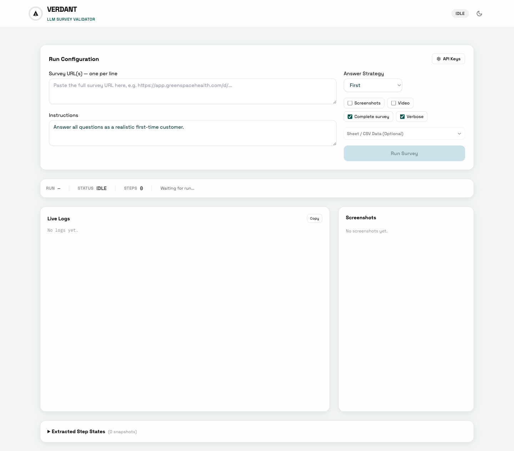
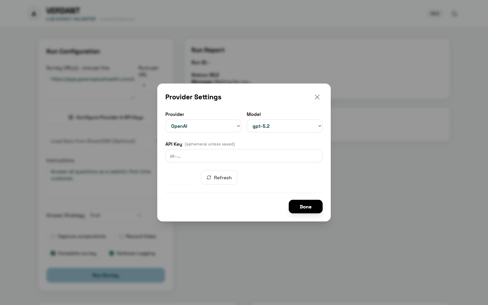
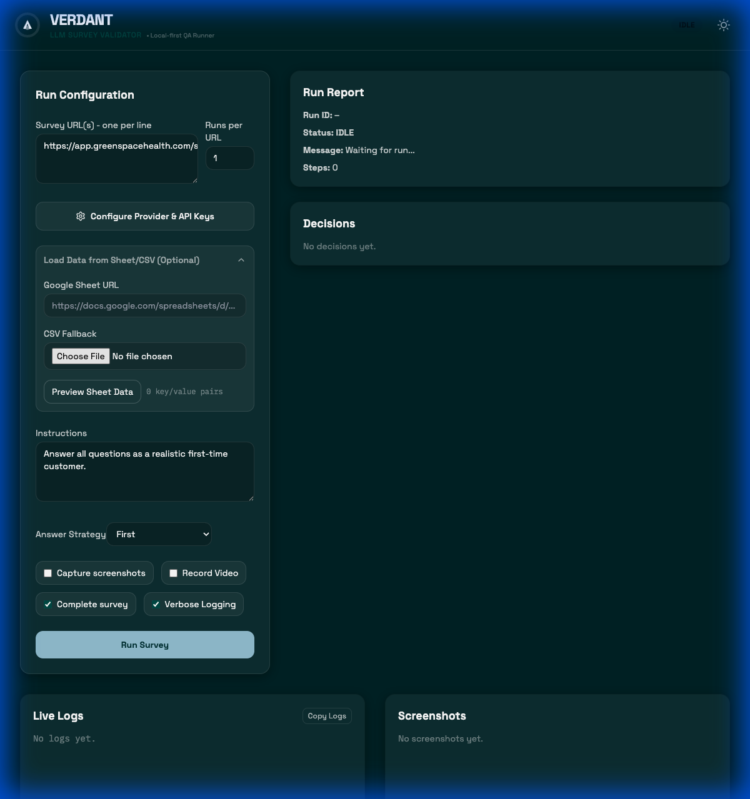
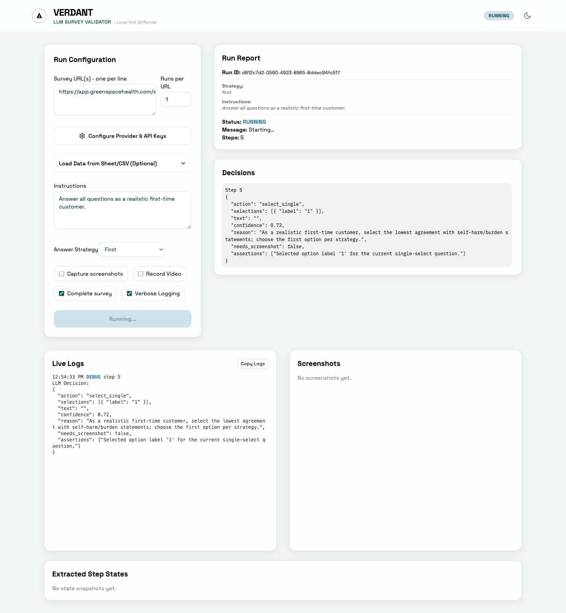

# Verdant Survey Validator - User Guide

This guide provides a comprehensive overview of the Verdant Survey Validator. It is designed to help you understand the interface, configure your survey runs, and monitor their progress.

## Table of Contents
1. [Overview](#overview)
2. [Getting Started](#getting-started)
3. [Run Configuration](#run-configuration)
   - [Survey URLs & Batches](#survey-urls--batches)
   - [Provider & API Keys](#provider--api-keys)
   - [Data & Instructions](#data--instructions)
   - [Answer Strategy](#answer-strategy)
   - [Run Options](#run-options)
4. [Executing a Run](#executing-a-run)
5. [Data-Driven Testing](#data-driven-testing)
   - [Google Sheets](#google-sheets)
   - [CSV Fallback](#csv-fallback)
   - [Using Variables](#using-variables-in-instructions)
6. [Monitoring Progress](#monitoring-progress)
   - [Run Report](#run-report)
   - [Decisions Panel](#decisions-panel)
   - [Live Logs](#live-logs)
   - [Visual Output](#screenshots)
7. [Troubleshooting](#troubleshooting)

---

## Overview

The Verdant Survey Validator is a local-first tool that uses LLMs (like OpenAI, Anthropic, etc.) to automatically navigate and validate your web surveys. It simulates a user, making decisions based on your instructions and a defined strategy, ensuring your surveys function correctly and the data flows as expected.



---

## Getting Started

### Prerequisites
Before you begin, ensure you have the following installed on your machine:
-   **Node.js** (version 20 or higher)
-   **npm** (usually comes with Node.js)

### Installation
Open your terminal and run the following commands to set up the project:

1.  **Clone the repository** (if you haven't already):
    ```bash
    git clone https://github.com/your-org/verdant.git
    cd verdant
    ```

2.  **Run the install script**:
    ```bash
    ./install.sh
    ```
    *(This handles npm dependencies and browser engines automatically)*

### Running the Application
To start both the backend runner and the frontend UI, run:

```bash
npm run dev
```

Or, if you prefer the helper script:

```bash
./start.sh
```

You will see output indicating that the runner and UI are starting. Once ready, open your browser to:
**[http://localhost:5173](http://localhost:5173)**

---

## Run Configuration

The **Run Configuration** panel is your control center. Here you define *what* to test and *how*.

### Survey URLs & Batches
*   **Survey URL(s)**: Enter the full URL of the survey you want to test. You can enter multiple URLs (one per line) to run them legally in a batch.
*   **Runs per URL**: Specify how many times you want the validator to run each URL. Useful for stress testing or verifying random logic.

### Provider & API Keys
Click the **Configure Provider & API Keys** button to open the settings modal.
*   **Provider**: Select your LLM provider (e.g., OpenAI, Anthropic).
*   **API Key**: Enter your API key for the selected provider. This is stored locally in your browser.
*   **Model**: Choose the specific model (e.g., `gpt-4o`, `claude-3-5-sonnet`) to power the validation.



### Data & Instructions
*   **Load Data from Sheet/CSV**: (Optional) You can load a CSV or Google Sheet to provide specific data rows for the runner to use (e.g., specific names, emails, or scenario variables).
*   **Instructions**: This is the "brain" of the runner. Describe the persona or specific actions the runner should take.
    *   *Example*: "Answer as a diabetic patient who is dissatisfied with their current treatment."
    *   *Example*: "Select 'Yes' for all required consent forms."

### Answer Strategy
Defines how the runner selects options for multiple-choice questions:
*   **First**: Always selects the first available option.
*   **Last**: Always selects the last available option.
*   **Random**: Selects a random option. The selection is seeded by the run ID and question text, so the same run always produces the same choices (reproducible).
*   **Ruleset**: Uses a JSON configuration for fine-grained control over how each question type is answered. See [Ruleset Configuration](#ruleset-configuration) below.

> **Note:** The strategy acts as a *fallback* when the LLM cannot determine an answer, and also informs the LLM's decision-making via the system prompt. Most of the time the LLM will follow your **Instructions** field; the strategy takes over when the LLM is uncertain or unavailable.

#### Ruleset Configuration

When **Ruleset** is selected, a JSON editor appears. The configuration object has three optional keys:

```json
{
  "singleSelect": "first" | "last" | "random",
  "multiSelect": {
    "mode": "first_n" | "all" | "random_n",
    "n": 2
  },
  "text": {
    "default": "AUTO_TEST_RESPONSE",
    "byKeyword": {
      "email": "test.user@example.com",
      "name": "Test User"
    }
  }
}
```

| Key | Description |
|-----|-------------|
| `singleSelect` | How to pick from **single-choice** questions. One of `"first"`, `"last"`, or `"random"` (seeded). Defaults to `"first"`. |
| `multiSelect.mode` | How to pick from **multi-choice** questions. `"first_n"` selects the first N options; `"all"` selects every option; `"random_n"` selects N options at random (seeded). Defaults to `"first_n"`. |
| `multiSelect.n` | Number of options to select when mode is `"first_n"` or `"random_n"`. Must be between 1–10. Defaults to `2`. |
| `text.default` | Default answer for any free-text input field. Defaults to `"AUTO_TEST_RESPONSE"`. |
| `text.byKeyword` | Map of **keyword → answer** for free-text fields. If the question text contains the keyword (case-insensitive), the corresponding answer is used instead of the default. Useful for filling in emails, names, dates, etc. |

**Example** — select the first single-choice option, the first 3 multi-choice options, and fill text fields intelligently:

```json
{
  "singleSelect": "first",
  "multiSelect": { "mode": "first_n", "n": 3 },
  "text": {
    "default": "N/A",
    "byKeyword": {
      "email": "tester@example.com",
      "name": "Jane Doe",
      "date": "2024-01-15"
    }
  }
}
```

### Run Options
*   **Capture screenshots**: Saves a screenshot at every step of the survey.
*   **Record Video**: Records a full video of the session (requires a supported browser setup).
*   **Complete survey**: If checked, the runner attempts to reach the "Thank You" page. If unchecked, it may stop early for debugging.
*   **Verbose Logging**: Enables detailed debug logs in the "Live Logs" panel.

## Executing a Run

Once configured, click the large **Run Survey** button.
*   The button text will change to **Running...**.
*   The **Run Report** panel will immediately light up with the status `RUNNING`.


---

## Data-Driven Testing

You can power your surveys with external data to test different scenarios (e.g., different patient names, conditions, or demographics).



### Google Sheets

This is the recommended method for data management.

1.  **Create a New Sheet**: Go to [sheets.google.com](https://sheets.google.com) and create a new blank sheet.
2.  **Add Headers**: The first row **must** contain your variable names.
    *   *Example*: `Patient Name`, `Age`, `Condition`, `Email`
3.  **Add Data**: Fill in the rows below with your test cases. Each row represents one unique run.
4.  **Set Permissions**:
    *   Click **Share** in the top right.
    *   Change access to **"Anyone with the link"** -> **"Viewer"**.
5.  **Copy Link**: Copy the full URL from your browser address bar.
6.  **Paste in Validator**: Paste this URL into the **"Google Sheet URL"** field in the runner.

### CSV Fallback

If you cannot use Google Sheets, you can paste raw CSV data directly.

1.  **Format**: Standard CSV format. First line must be headers.
    ```csv
    Patient Name,Age,Condition
    John Doe,45,Diabetes
    Jane Smith,29,Hypertension
    ```
2.  **Paste**: Copy the raw text and paste it into the **"CSV Content"** box.
3.  **Upload**: Alternatively, use the **"Upload CSV"** button to load a file from your computer.

### Using Variables in Instructions

Once your data is loaded, the runner sees it as a list of key-value pairs for the current run. You simply need to tell the runner to use it in the **Instructions** field.

**Example Instructions:**
> "Answer the survey as the patient named **{{Patient Name}}**. You are **{{Age}}** years old and suffering from **{{Condition}}**. When asked for email, use **{{Email}}**."

*Note: You don't strictly need the `{{}}` syntax, but it helps clarity. You can just say "Use the patient name from the data".*

---

## Monitoring Progress

As the survey runs, the dashboard updates in real-time.



### Run Report
Located at the top right, this panel gives you the high-level status.
*   **Status**: Current state (`RUNNING`, `SUCCESS`, `BLOCKED`, `ERROR`).
*   **Message**: The current activity (e.g., "Step 5: Analyzing question...").
*   **Steps**: The total number of steps taken so far.

### Decisions Panel
This panel shows the "thought process" of the LLM. For each step, it displays a JSON object containing:
*   **Action**: What did it do? (e.g., `select_single`, `type_text`, `click_next`).
*   **Reason**: Why did it do that? (The LLM's explanation based on your instructions).
*   **Confidence**: How confident was it? (0-1 score).

### Live Logs
A scrolling terminal view that shows every technical event.
*   **Blue/Info**: Standard progress.
*   **Red/Error**: Something went wrong.
*   **Yellow/Warn**: Assertion failures or retries.

### Visual Output
If enabled, screenshots appear here in a grid as they are captured, allowing you to visually verify what the runner saw.

## Troubleshooting

*   **Runner Stuck?** The runner has built-in stagnation detection. If it tries the same action twice and fails (e.g., assertions fail), it effectively "gives up" to prevent infinite loops. Check the **Live Logs** for "Assertions failed".
*   **"Blocked" Status**: This usually means the runner found the page but couldn't find a valid question or navigation button. Check your **Instructions** or **URL**.
*   **API Errors**: If the run fails immediately, check your API Key in the **Provider Settings**.
